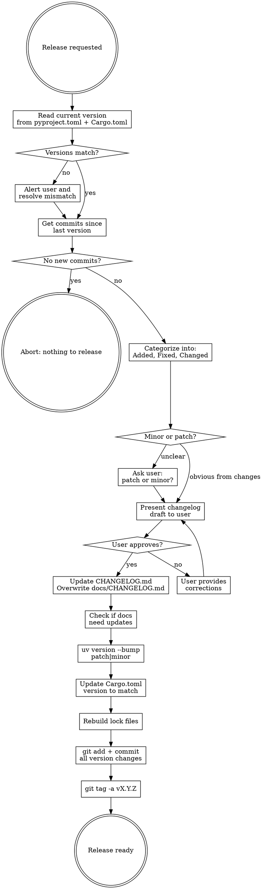

# Bump Version

Generate a changelog entry from git history, update version numbers, sync docs, and create a git tag.

## Overview

This skill automates the rustest release workflow: analyze git commits since the last release, draft a Keep a Changelog entry, bump versions in both `pyproject.toml` and `Cargo.toml`, sync `docs/CHANGELOG.md`, commit all changes, and tag the release.

## When to Use

- User asks to bump the version, prepare a release, or update the changelog
- User says "release", "version bump", "changelog", "tag"
- After a set of features/fixes are merged and ready for release

## Workflow



## Steps

### 1. Determine Current Version

Read the current version from both files and verify they match:

```bash
grep '^version = ' pyproject.toml Cargo.toml
```

**If versions don't match**: Alert the user. The `pyproject.toml` version is the source of truth. Ask the user whether to sync Cargo.toml to match before proceeding, or abort.

### 2. Get Commits Since Last Release

Try in order until one works:

1. **Tag-based** (preferred): `git log v<current-version>..HEAD --oneline`
2. **Changelog-based fallback**: Find the version bump commit (search for "Bump version" in log), then `git log <that-commit>..HEAD --oneline`
3. **Manual fallback**: `git log --oneline -30` and identify commits since last version bump

**If no new commits exist**: Inform the user there's nothing to release and abort.

**Note**: If no git tags exist yet (check with `git tag -l`), skip approach 1 and use approach 2 or 3.

### 3. Categorize Changes

Read each commit and sort into Keep a Changelog categories:

| Category | What belongs |
|----------|-------------|
| **Added** | New features, fixtures, CLI options, test capabilities |
| **Fixed** | Bug fixes, compatibility fixes, error corrections |
| **Changed** | Refactors, performance improvements, behavior changes |

**If a commit spans multiple categories** (e.g., adds a feature AND fixes a bug), split it into separate entries under each relevant category. This matches the existing CHANGELOG.md convention.

**Writing style** (match existing `CHANGELOG.md` tone):
- Start entries with **Bold Category Label**: followed by description
- Use nested bullet points for sub-details
- Be specific about what changed and why it matters to users
- Skip: version bump commits, changelog update commits, merge commits, CI-only changes

**Existing `[Unreleased]` content**: The CHANGELOG.md may already have an `[Unreleased]` section with entries. Compare these against the commits found in Step 2. Use the existing unreleased entries as the starting point — they may be more detailed than commit messages. Add any missing commits, and remove any entries for commits not actually in the range.

### 4. Determine Bump Type

**Auto-determine when obvious:**
- Only bug fixes and minor improvements → **patch**
- New features or capabilities → **minor**
- Breaking changes → **major** (rare, confirm with user)

**Ask the user** when the type is unclear or user hasn't specified.

### 5. Present and Confirm

**MANDATORY**: Before writing anything, present the full changelog draft to the user:

> "Here's the changelog I've drafted for version X.Y.Z. Is this complete and accurate?"

Show entries exactly as they'll appear in the file. **Do NOT write to any files until the user confirms.**

### 6. Update CHANGELOG.md

1. Replace the `[Unreleased]` section content with the approved entries under a new `## [X.Y.Z] - YYYY-MM-DD` header
2. Add a fresh empty `## [Unreleased]` section above it
3. **Overwrite `docs/CHANGELOG.md`** with the full contents of root `CHANGELOG.md` (the docs copy may be stale — always do a full copy, not incremental)

**Format** (Keep a Changelog):
```markdown
## [Unreleased]

## [X.Y.Z] - YYYY-MM-DD

### Added

- **Feature Name**: Description of what was added
  - Sub-detail if needed

### Fixed

- **Bug Area**: Description of what was fixed

### Changed

- **Area**: Description of what changed
```

### 7. Check Documentation

Scan for version references or content needing updates:
- `docs/index.md` - Check for version references
- `README.md` - Check for version-specific content
- `docs/guide/*.md` - Check if new features need documentation

Flag needed doc updates to user; don't auto-generate docs without approval.

### 8. Bump Version Numbers

**pyproject.toml** (via uv):
```bash
uv version --bump patch   # or: uv version --bump minor
```

**Cargo.toml** - Edit manually to match the new version from pyproject.toml.

**Lock files** - Regenerate:
```bash
cargo generate-lockfile    # Updates Cargo.lock
uv lock                    # Updates uv.lock
```

### 9. Commit All Changes

**CRITICAL**: All version changes must be committed before creating the tag.

```bash
git add CHANGELOG.md docs/CHANGELOG.md pyproject.toml Cargo.toml Cargo.lock uv.lock
git commit -m "Bump version to X.Y.Z and update changelog"
```

Include any other files modified during documentation updates (Step 7).

### 10. Create Git Tag

```bash
git tag -a vX.Y.Z -m "Release vX.Y.Z"
```

Use annotated tags (`-a`). Format: `vX.Y.Z` (e.g., `v0.17.0`).

**Do NOT push the tag or commits** unless the user explicitly asks.

## Version Locations

All must stay in sync:

| File | Update method |
|------|---------------|
| `pyproject.toml` | `uv version --bump` |
| `Cargo.toml` | Manual edit to match |
| `Cargo.lock` | `cargo generate-lockfile` |
| `uv.lock` | `uv lock` |
| `CHANGELOG.md` | Manual edit |
| `docs/CHANGELOG.md` | Full copy from root |

## Common Mistakes

| Mistake | Fix |
|---------|-----|
| Forgetting to commit before tagging | Tag points to a commit — all changes must be committed first |
| Forgetting `Cargo.toml` | Always update both pyproject.toml AND Cargo.toml |
| Incremental sync of `docs/CHANGELOG.md` | Always overwrite docs copy fully from root (it may be stale) |
| Pushing tags before user confirms | Only create local tags unless asked to push |
| Writing changelog before approval | Always present draft first |
| Using lightweight tags | Use `git tag -a` for annotated tags |
| Leaving stale `[Unreleased]` content | Clear it and create fresh empty section |
| Ignoring existing `[Unreleased]` entries | Use them as starting point, validate against actual commits |

## Quick Reference

```bash
# Read current version
grep '^version = ' pyproject.toml Cargo.toml

# Check if tags exist
git tag -l

# Get commits since last version (use whichever works)
git log v0.16.1..HEAD --oneline          # if tags exist
git log <version-bump-commit>..HEAD --oneline  # fallback

# Bump with uv
uv version --bump patch    # 0.16.1 → 0.16.2
uv version --bump minor    # 0.16.1 → 0.17.0

# Regenerate locks
cargo generate-lockfile
uv lock

# Commit everything
git add CHANGELOG.md docs/CHANGELOG.md pyproject.toml Cargo.toml Cargo.lock uv.lock
git commit -m "Bump version to X.Y.Z and update changelog"

# Create annotated tag
git tag -a vX.Y.Z -m "Release vX.Y.Z"
```
